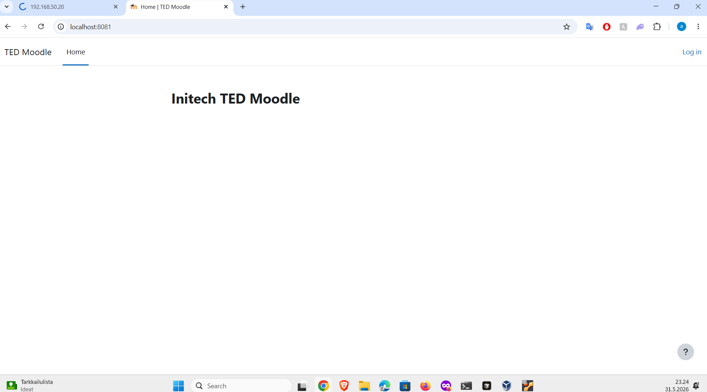
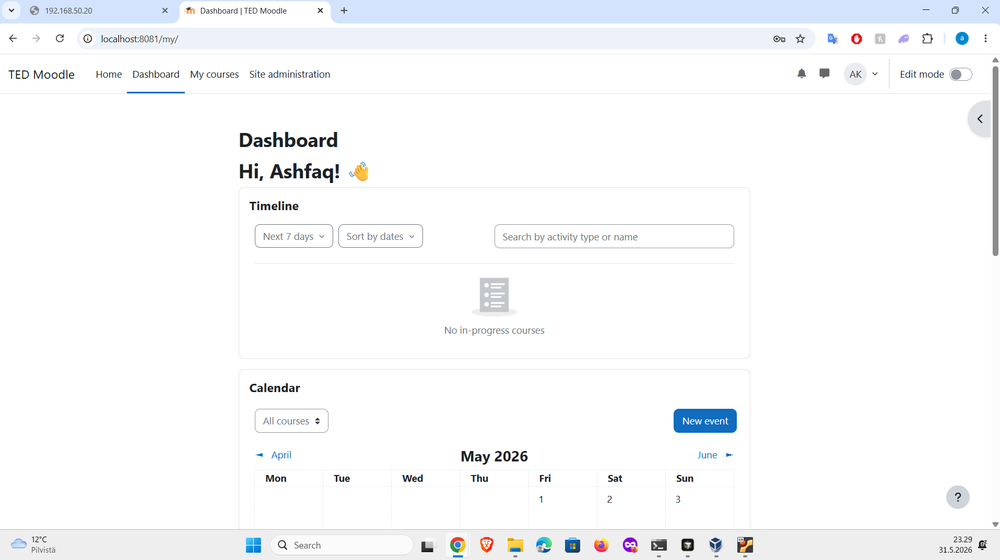
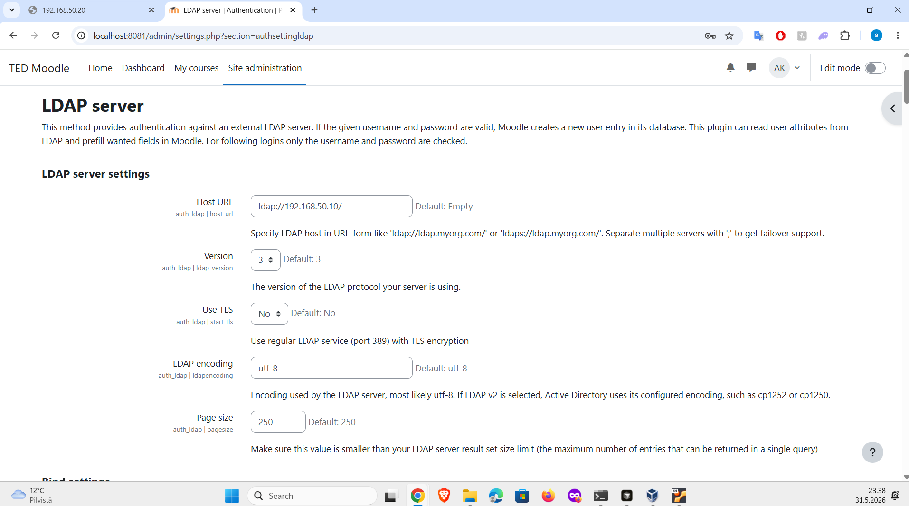
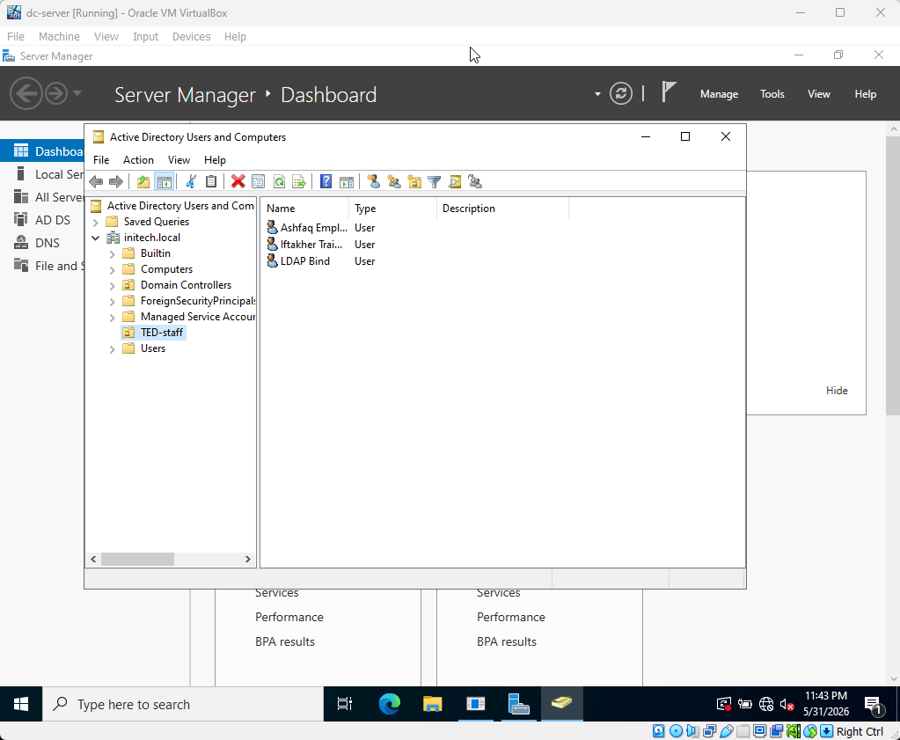
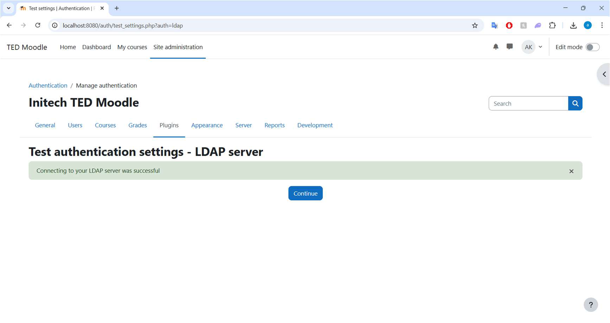
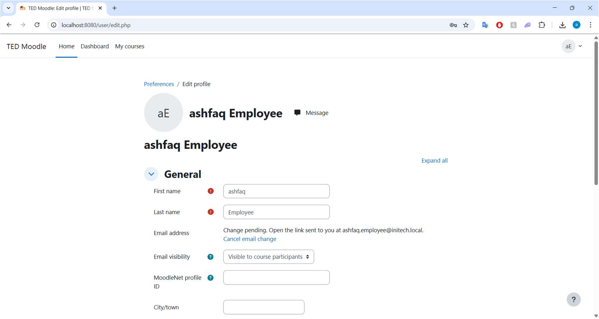
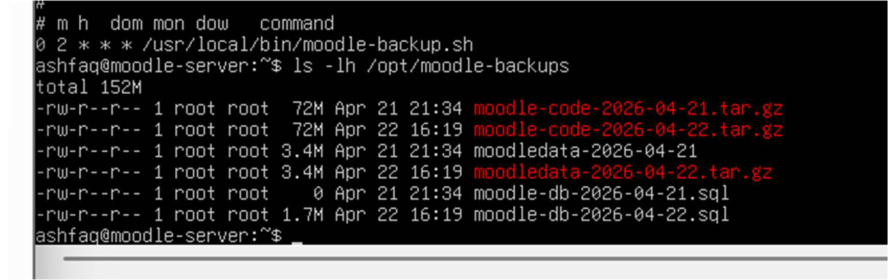
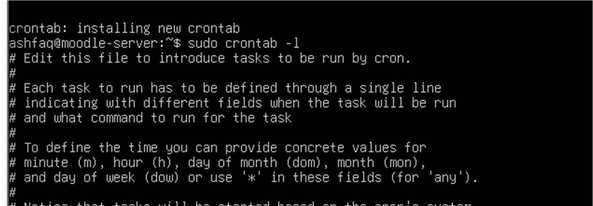

# Moodle LDAP Learning Platform

## Overview

This project demonstrates a Moodle learning platform deployed on Ubuntu Server and integrated with Windows Server Active Directory authentication using LDAP.

The goal was to create an internal company-style learning platform where users can log in using their own domain credentials.

## Project Goals

- Deploy Moodle on Ubuntu Server
- Configure Apache, PHP, and MariaDB
- Connect Moodle to Windows Server Active Directory
- Enable LDAP authentication
- Test login using domain users
- Configure scheduled backups

## Technologies Used

- Ubuntu Server
- Apache
- PHP
- MariaDB / MySQL
- Moodle
- Windows Server
- Active Directory
- LDAP
- Cron
- mysqldump
- VirtualBox

## Features Implemented

- Moodle installed on Ubuntu Server
- Database configured with MariaDB
- LDAP authentication connected to Active Directory
- Domain users can log in to Moodle
- Scheduled backup using cron and mysqldump

## Screenshots

### 1. Moodle Login Page

This screenshot shows the deployed TED Moodle site accessible from the browser through VirtualBox NAT port forwarding.

### 2. Moodle Admin Dashboard

This screenshot shows the Moodle dashboard after successful login.

### 3. LDAP Server Settings

This screenshot shows Moodle LDAP configuration connected to the Windows Server domain controller.

### 4. Active Directory Users

This screenshot shows the Active Directory users and LDAP bind account created inside the `initech.local` domain.

### 5. LDAP Test Successful

This screenshot shows Moodle successfully connecting to the LDAP server.

### 6. Domain User Moodle Login

This screenshot shows successful Moodle login using an Active Directory employee account through LDAP.

### 7. Moodle Backup Files

This screenshot shows Moodle database, Moodle data, and Moodle code backup files created on the Ubuntu server.

### 8. Automated Cron Backup

This screenshot shows the cron job configured to run the Moodle backup script automatically every day.

## What I Learned

- How to deploy a web application on Linux
- How Apache, PHP, and MariaDB work together
- How Moodle authentication can be connected to Active Directory
- How LDAP login works
- How to automate backups with cron
- How to troubleshoot Linux and Windows Server integration

## Future Improvements

- Add HTTPS with SSL certificate
- Add Google OAuth login
- Improve backup storage
- Add monitoring
